Visualization 01 - Introduction - Completed Version
================
Yujie Su, M.S. & Matthew Schuelke, Ph.D.
(August 23, 2019)

## Introduction

Data visualization (dataviz) is an essential component of your skill set
as a data scientist. Data visualization is statistics and design
combined in meaningful and appropriate ways. On the one hand, dataviz is
a form of graphical data analysis, emphasizing accurate representation
and interpretation of data. On the other hand, dataviz relies on good
design principles to not only make our plots attractive, but also
meaningful and not misleading. The right visual representation will
reveal hidden insights.

## Load Dependencies

The following code loads the package dependencies for our analysis:

``` r
library(dplyr)    # data wrangling
```

    ## 
    ## Attaching package: 'dplyr'

    ## The following objects are masked from 'package:stats':
    ## 
    ##     filter, lag

    ## The following objects are masked from 'package:base':
    ## 
    ##     intersect, setdiff, setequal, union

``` r
library(ggplot2)  # data plotting
library(readr)    # work with csv files
library(cowplot)  # an add-on to ggplot2
```

    ## Warning: package 'cowplot' was built under R version 3.6.1

    ## 
    ## ********************************************************

    ## Note: As of version 1.0.0, cowplot does not change the

    ##   default ggplot2 theme anymore. To recover the previous

    ##   behavior, execute:
    ##   theme_set(theme_cowplot())

    ## ********************************************************

Now you try loading an additional package - `here` (for working with
file
    paths):

``` r
library(here)
```

    ## Warning: package 'here' was built under R version 3.6.1

    ## here() starts at C:/Users/schuelkem/OneDrive - Saint Louis University/Data Science Seminar/repos/visualization-01

We have now loaded all of the packages needed for our analyses.

## Load Data

``` r
houseWide <- read_csv(here('data', 'houseWide.csv'))
```

    ## Parsed with column specification:
    ## cols(
    ##   Id = col_double(),
    ##   Year = col_double(),
    ##   Ages = col_character(),
    ##   Style = col_character(),
    ##   LotArea = col_double(),
    ##   GrLivArea = col_double(),
    ##   SalePrice = col_double()
    ## )

  - The housing price related dataset was compiled by Dean De Cock for
    use in data science education, pulled from
    [Kaggle](https://www.kaggle.com/c/house-prices-advanced-regression-techniques/data).

## Explore Data

``` r
print(houseWide)
```

    ## # A tibble: 190 x 7
    ##       Id  Year Ages  Style    LotArea GrLivArea SalePrice
    ##    <dbl> <dbl> <chr> <chr>      <dbl>     <dbl>     <dbl>
    ##  1     1  2004 Young OneStory    3182      1269    192000
    ##  2     2  1998 Young OneStory   10140      1680    213250
    ##  3     3  1950 Old   OneStory    9600      1067    128000
    ##  4     4  1992 Young TwoStory   10186      1923    190000
    ##  5     5  2006 Young TwoStory   15611      1919    233230
    ##  6     6  2005 Young OneStory    6955      1368    202500
    ##  7     7  1955 Old   Other       9600      1661    165500
    ##  8     8  1977 Young TwoStory   12227      2872    272000
    ##  9     9  1949 Old   TwoStory    6270      2002    145000
    ## 10    10  2009 Young TwoStory    3951      1224    164500
    ## # ... with 180 more rows

## Scatter plot

Here we plot `SalePrice` against `LotArea`.

``` r
ggplot(houseWide, aes(x = LotArea, y = SalePrice)) + 
  geom_point()
```

<!-- -->

## Statistics

And here we add a linear model on top of the previous scatterplot.

``` r
ggplot(houseWide, aes(x = LotArea, y = SalePrice)) + 
  geom_point() + 
  stat_smooth(method = 'lm', col = 'red', se = FALSE)
```

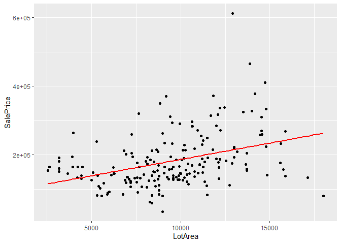<!-- -->

## Anscombe’s Quartet

An example of the usefulness of data visualization as a data analysis
tool is this classic example from Francis Anscombe, first published in
1973. Here, four different data sets can be described by the same linear
model. If we relied solely on the numerical output without plotting our
data, we’d have missed distinct and interesting underlying trends.

Dataset `anscombe` is included in base R, we can use that directly by
the name.

``` r
print(anscombe)
```

    ##    x1 x2 x3 x4    y1   y2    y3    y4
    ## 1  10 10 10  8  8.04 9.14  7.46  6.58
    ## 2   8  8  8  8  6.95 8.14  6.77  5.76
    ## 3  13 13 13  8  7.58 8.74 12.74  7.71
    ## 4   9  9  9  8  8.81 8.77  7.11  8.84
    ## 5  11 11 11  8  8.33 9.26  7.81  8.47
    ## 6  14 14 14  8  9.96 8.10  8.84  7.04
    ## 7   6  6  6  8  7.24 6.13  6.08  5.25
    ## 8   4  4  4 19  4.26 3.10  5.39 12.50
    ## 9  12 12 12  8 10.84 9.13  8.15  5.56
    ## 10  7  7  7  8  4.82 7.26  6.42  7.91
    ## 11  5  5  5  8  5.68 4.74  5.73  6.89

``` r
p1 <- ggplot(anscombe, aes(x = x1, y = y1)) +
  geom_point()+
  geom_smooth(method = 'lm', se = FALSE, color = 'red', fullrange = TRUE) +
  xlim(0,20) + ylim(0,14) +
  coord_cartesian(xlim = c(0:20),ylim = c(0:14)) +
  geom_text(x = 15, y = 2, label = 'y = 3.0001 + 0.5001 * X') +
  theme_classic()

p2 <- ggplot(anscombe, aes(x = x1, y = y2))+
  geom_point() + 
  geom_smooth(method = 'lm', se = FALSE, color = 'red', fullrange = TRUE) +
  xlim(0,20) + ylim(0,14) +
  geom_text(x = 15, y = 2, label = 'y = 3.0009 + 0.5000 * X') +
  theme_classic()
  
p3 <- ggplot(anscombe, aes(x = x1, y = y3))+
  geom_point() + 
  stat_smooth(method = 'lm', se = FALSE, color = 'red', fullrange = TRUE) +
  xlim(0,20) + ylim(0,14) +
  geom_text(x = 15, y = 2, label = 'y = 3.0025 + 0.4997 * X') +
  theme_classic()
  
p4 <- ggplot(anscombe, aes(x = x4, y = y4))+
  geom_point() + 
  stat_smooth(method = "lm", fullrange = TRUE, se = FALSE, color = 'red') +
  xlim(0,20) + ylim(0,14) +
  geom_text(x = 15, y = 2, label = 'y = 3.0017 + 0.4999 * X') +
  theme_classic()

plot_grid(p1, p2, p3, p4, labels = c('A', 'B', 'C', 'D'))
```

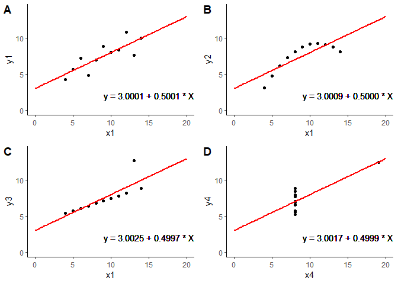<!-- -->

## Grammar of Graphics

Although visualization is clearly based in statistics and graphical data
analysis, it’s a creative process that involves some amount of trial and
error.

In this part, we are going to explore data with many different
perspectives. We’ll also understand how the structure of our data helps
us to make meaningful comparisons. We’ll cover data visualization in
detail from both theoretical and practical perspectives. The focus will
be on the Grammar of Graphics as implemented by the ggplot2 package.

Next let’s explore the house data set step by step. The data set
contains information of the property’s sale price in dollars, above
grade living area, lot area, ages, and property’s structure style.

The first step in thinking creatively about data visualization is to
appreciate that graphics are built upon an underlying grammar. There are
two key things to note about the Grammar of Graphics.

  - Graphics are made up of distinct layers of grammatical elements.

  - Meaningful plots are built around appropriate aesthetic mappings.

**Grammatical Elements**

All plots are composed of:

  - Some **data** that you wish to visualise and a set of aesthetic
    **mapping**s describing how variables in the data are mapped to
    aesthetic attributes one could perceive.

  - The **layers** are made up of geometric elements and statistical
    transformations. Geometric objects (**geom**s) represent what you
    actually see. Statistical transformations (**stat**s) summarise
    data.

  - The **scale**s map values in the data space to values in the
    aesthetic space.

  - A coordinate system (**coord**) describes how data coordinates are
    mapped to the plane of the graphic.

  - A **facet**ing specification describes how to break up and display
    data in subsets.

  - A **theme** controls the finer points of display.

The Grammar of Graphics established the building blocks for solid,
creative, and meaningful data visualizations. This means we are not
limited to specific, standard forms of expression because now we have a
framework that allows us to communicate in a way that best suits our
goal.

## ggplot2

The grammar of graphics is implemented in R using the `ggplot2` package.

We construct plots by layering grammatical elements on top of each other
and use aesthetic mappings to define our visualizations.

**data**

The first layer is data, we need some data to plot. The `houseWide` data
set contains information of the property’s sale price in dollars, above
grade living area, lot area, ages, building years and property’s
structure style.

``` r
print(houseWide)
```

    ## # A tibble: 190 x 7
    ##       Id  Year Ages  Style    LotArea GrLivArea SalePrice
    ##    <dbl> <dbl> <chr> <chr>      <dbl>     <dbl>     <dbl>
    ##  1     1  2004 Young OneStory    3182      1269    192000
    ##  2     2  1998 Young OneStory   10140      1680    213250
    ##  3     3  1950 Old   OneStory    9600      1067    128000
    ##  4     4  1992 Young TwoStory   10186      1923    190000
    ##  5     5  2006 Young TwoStory   15611      1919    233230
    ##  6     6  2005 Young OneStory    6955      1368    202500
    ##  7     7  1955 Old   Other       9600      1661    165500
    ##  8     8  1977 Young TwoStory   12227      2872    272000
    ##  9     9  1949 Old   TwoStory    6270      2002    145000
    ## 10    10  2009 Young TwoStory    3951      1224    164500
    ## # ... with 180 more rows

**mapping**

The next step is aesthetics, which tells us which **scales** we should
map our data onto. We establish a graphic mapping
here.

``` r
ggplot(houseWide, aes(x = LotArea, y = SalePrice))
```

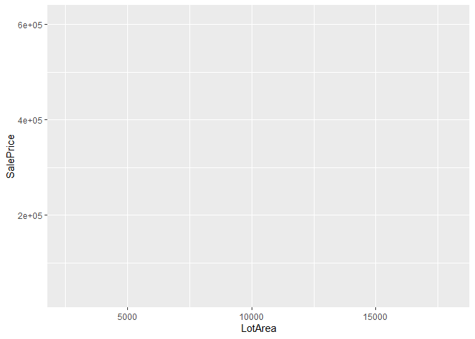<!-- -->

Note that we do not see anything until we add another layer.

``` r
ggplot(houseWide, aes(x = LotArea, y = SalePrice)) + 
  geom_point()
```

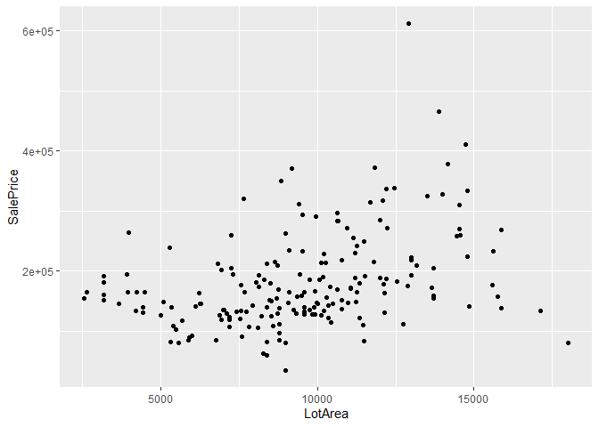<!-- -->

Now you plot the transpose of the above plot. That is, map `LotArea` to
the y aesthetic and `SalePrice` to the x aesthetic.

``` r
ggplot(houseWide, aes(x = SalePrice, y = LotArea)) + 
  geom_point()
```

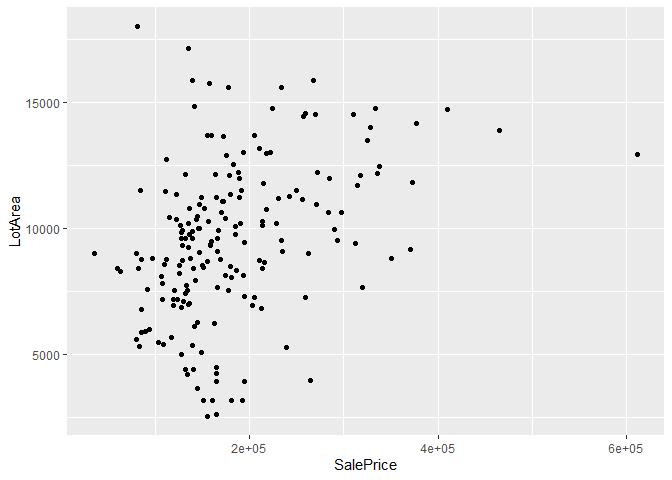<!-- -->

There are other available arguments in the aesthetics layer, like color
and alpha.

*color*

``` r
ggplot(houseWide, aes(x = LotArea, y = SalePrice, color = Style)) + 
  geom_point()
```

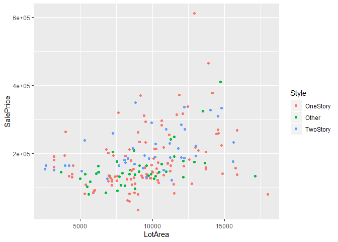<!-- -->

*alpha*

``` r
ggplot(houseWide, aes(x = LotArea,y = SalePrice, alpha = Year)) + 
  geom_point()
```

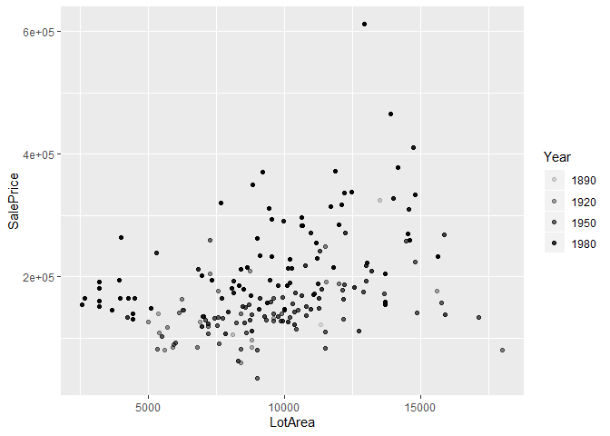<!-- -->

Now you use the `houseWide` dataset to to create a scatter plot of
`SalePrice` as a function of `GrLivArea`, and use color to indicate
different `Ages`.

``` r
ggplot(houseWide, aes(x = GrLivArea, y = SalePrice, color = Ages)) + 
  geom_point()
```

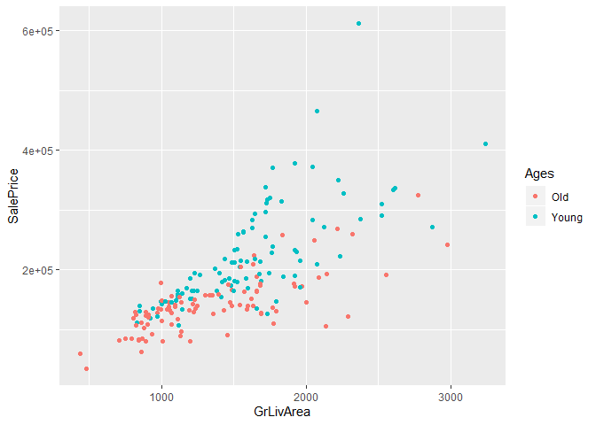<!-- -->

**geom**s

The second layer allows us to choose the geometry.

We have already use `geom_point()` to make a scatterplot. We could also
construct histograms, boxplots, etc…

Here is an example of a histogram describing the distribution of
`SalePrice`.

*geom\_histogram*

``` r
ggplot(houseWide, aes(x = SalePrice)) + 
  geom_histogram()
```

    ## `stat_bin()` using `bins = 30`. Pick better value with `binwidth`.

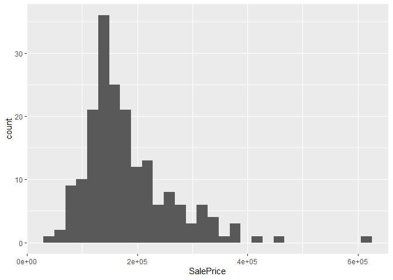<!-- -->

Now you try to create a histogram describing the distribution of
`LotArea`.

``` r
ggplot(houseWide, aes(x = LotArea)) + 
  geom_histogram()
```

    ## `stat_bin()` using `bins = 30`. Pick better value with `binwidth`.

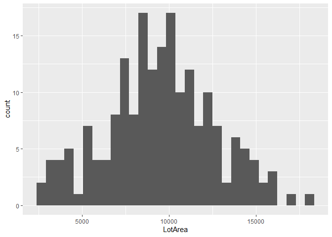<!-- -->

**facet**s

We could use the other layers to get a meaningful and cleaner
visualization.

The next layer we’ll use is facets, which dictates how to split up our
plot. In this case we want to make three separate plots, one for each of
the three styles.

``` r
ggplot(houseWide, aes(x = LotArea, y = SalePrice)) + 
  geom_point() + 
  facet_grid(. ~ Style)
```

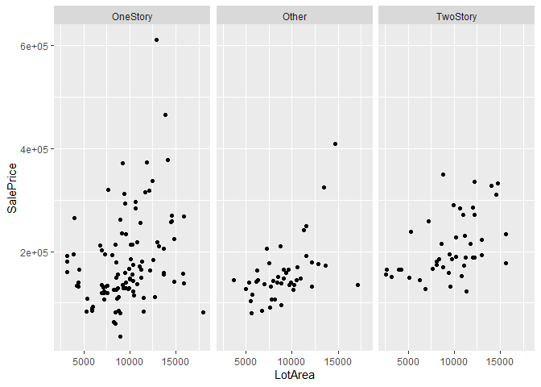<!-- -->

**stat**s

The statistics layer can be used to calculate and add many different
parameters. Here we’ve chosen to add a linear model to each of the three
subplots.

``` r
ggplot(houseWide, aes(x = LotArea, y = SalePrice)) + 
  geom_point() + 
  stat_smooth(method = 'lm', se = FALSE, col = 'red') + 
  facet_grid(. ~ Style)
```

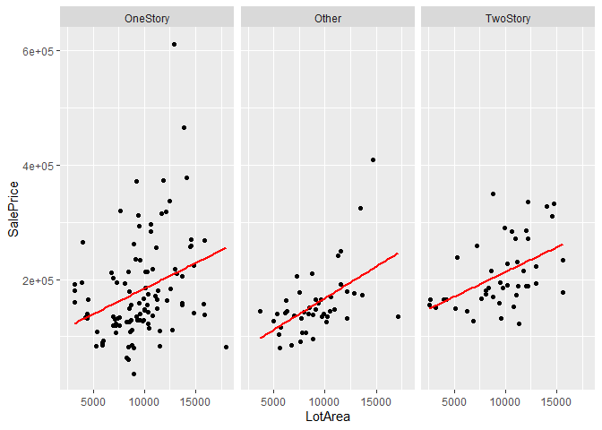<!-- -->

**scale**s

We can also manipulate coordinates, which allows us to specify the
precise dimensions the plot. Here we set the specific names of x axis
and y axis.

``` r
ggplot(houseWide, aes(x = LotArea, y = SalePrice)) + 
  geom_point() + 
  stat_smooth(method = 'lm', se = FALSE, col = 'red') +
  scale_x_continuous(name = 'LotArea (square feet)') + 
  scale_y_continuous(name = 'SalePrice (dollars)') + 
  facet_grid(. ~ Style)
```

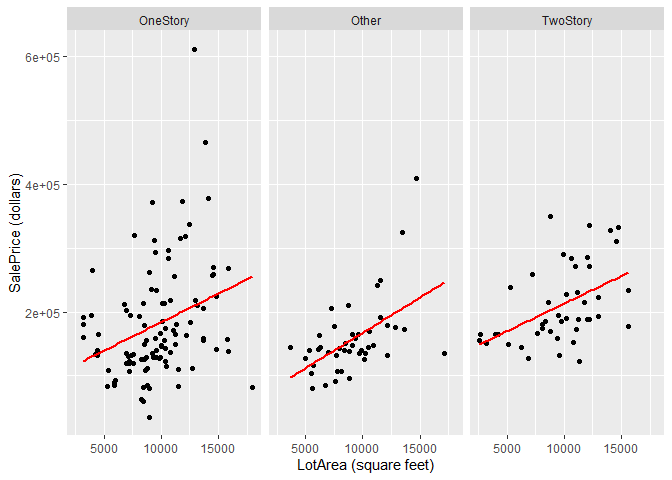<!-- -->

**theme**s

Finally, the theme layer controls all the non-data ink on our plot,
which allows us to get a nice looking, meaningful and publication
quality plot directly in R.

*theme\_excel*

``` r
ggplot(houseWide, aes(x = LotArea, y = SalePrice)) + 
  geom_point() + 
  stat_smooth(method = 'lm', se = FALSE, col = 'red') +
  scale_x_continuous(name = 'LotArea (square feet)') + 
  scale_y_continuous(name = 'SalePrice (dollars)') +
  facet_grid(. ~ Style) + 
  ggthemes::theme_excel()
```

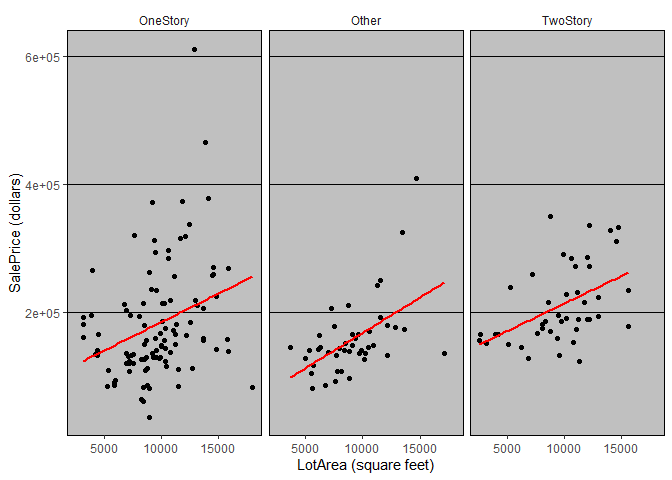<!-- -->

Let’s try tufte theme next

*theme\_tufte()*

``` r
ggplot(houseWide, aes(x = LotArea, y = SalePrice)) + 
  geom_point() + 
  stat_smooth(method = 'lm', se = FALSE, col = 'red') +
  scale_x_continuous(name = 'LotArea (square feet)') + 
  scale_y_continuous(name = 'SalePrice (dollars)') + 
  facet_grid(. ~ Style) + 
  ggthemes::theme_tufte()
```

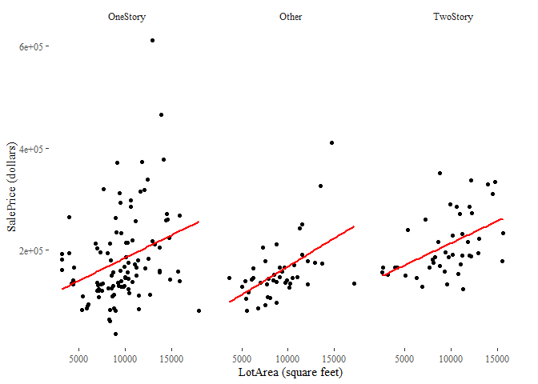<!-- -->

We could also set a customized theme manually.

``` r
ggplot(houseWide, aes(x = LotArea, y = SalePrice)) + 
  geom_point() + 
  facet_grid(. ~ Style) + 
  stat_smooth(method = 'lm', se = FALSE, col = 'red') +
  labs(x = 'LotArea (square feet)', y = 'SalePrice (dollars)' ) + 
  theme(panel.background = element_blank(),
        plot.background = element_blank(),
        legend.background = element_blank(),
        strip.background = element_blank(),
        legend.key = element_blank(),
        axis.text = element_text(colour = 'black'),
        axis.ticks = element_line(colour = 'black'),
        axis.line = element_line(colour = 'black'))
```

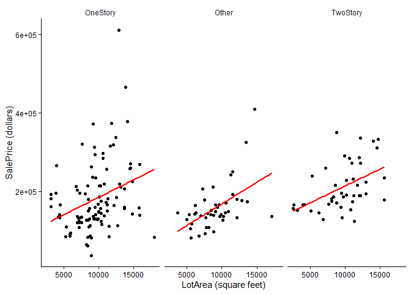<!-- -->

Now you try to create a scatter plot of `SalePrice` as a function of
`GrLivArea` and facet by `Ages`. Add a linear fitted line to each facet.
Set appropriate x and y axis labels. Finally, add a manual theme.

``` r
ggplot(houseWide, aes(x = GrLivArea, y = SalePrice)) + 
  geom_point() + 
  stat_smooth(method = 'lm', se = FALSE, col = 'red') +
  labs(x = 'GrLivArea (square feet)', y = 'SalePrice (dollars)' ) + 
  facet_grid(. ~ Ages) + 
  theme(panel.background = element_blank(),
        plot.background = element_blank(),
        legend.background = element_blank(),
        strip.background = element_blank(),
        legend.key = element_blank(),
        axis.text = element_text(colour = 'black'),
        axis.ticks = element_line(colour = 'black'),
        axis.line = element_line(colour = 'black'))
```

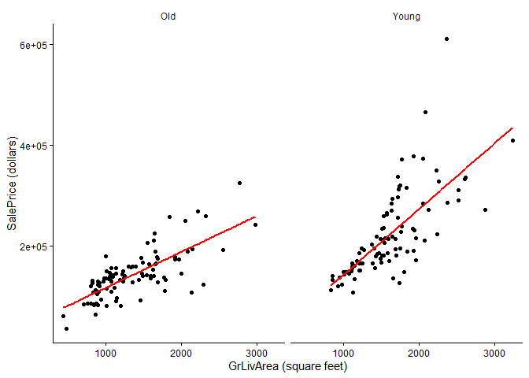<!-- -->
